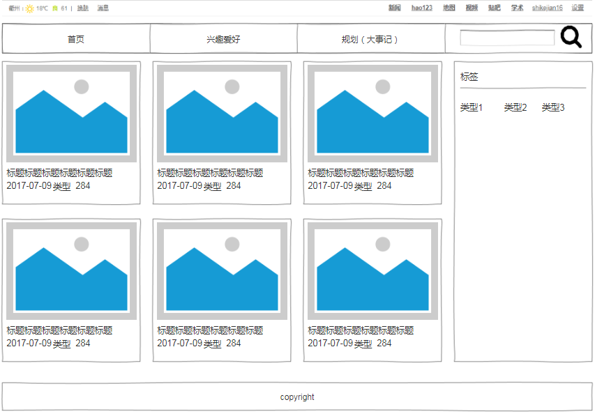
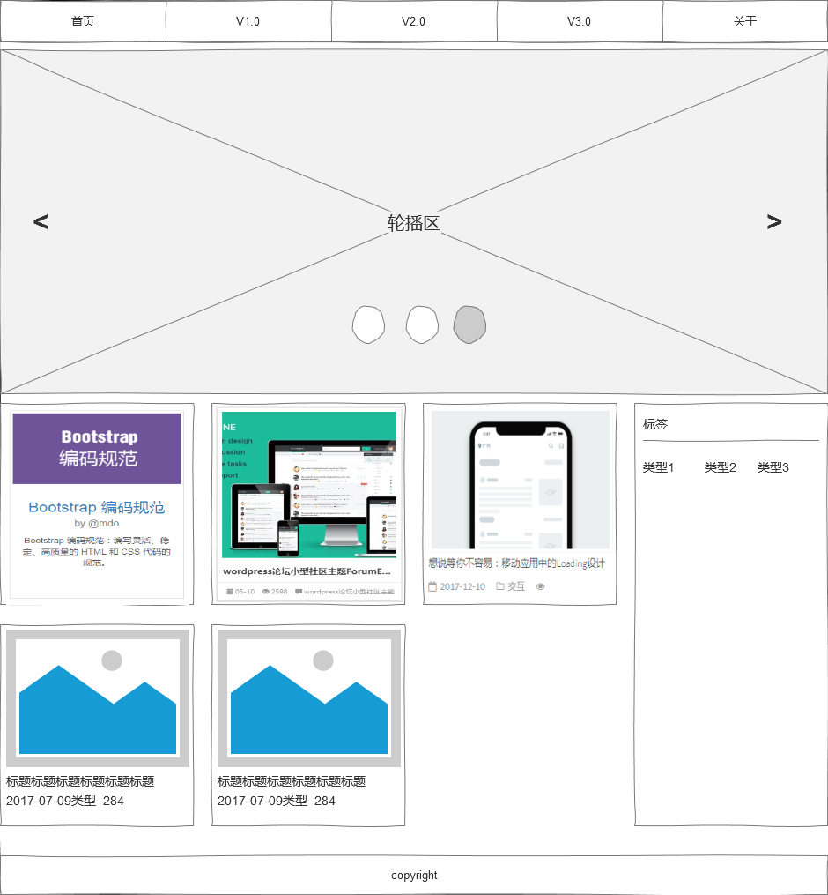
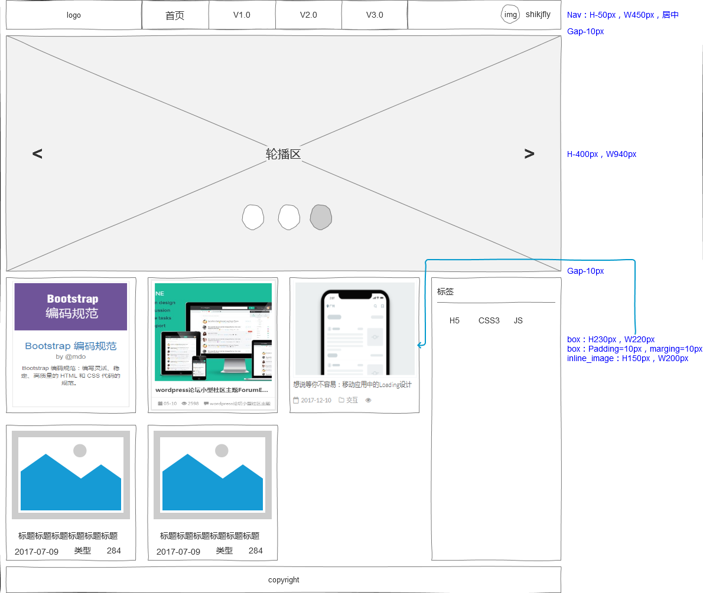
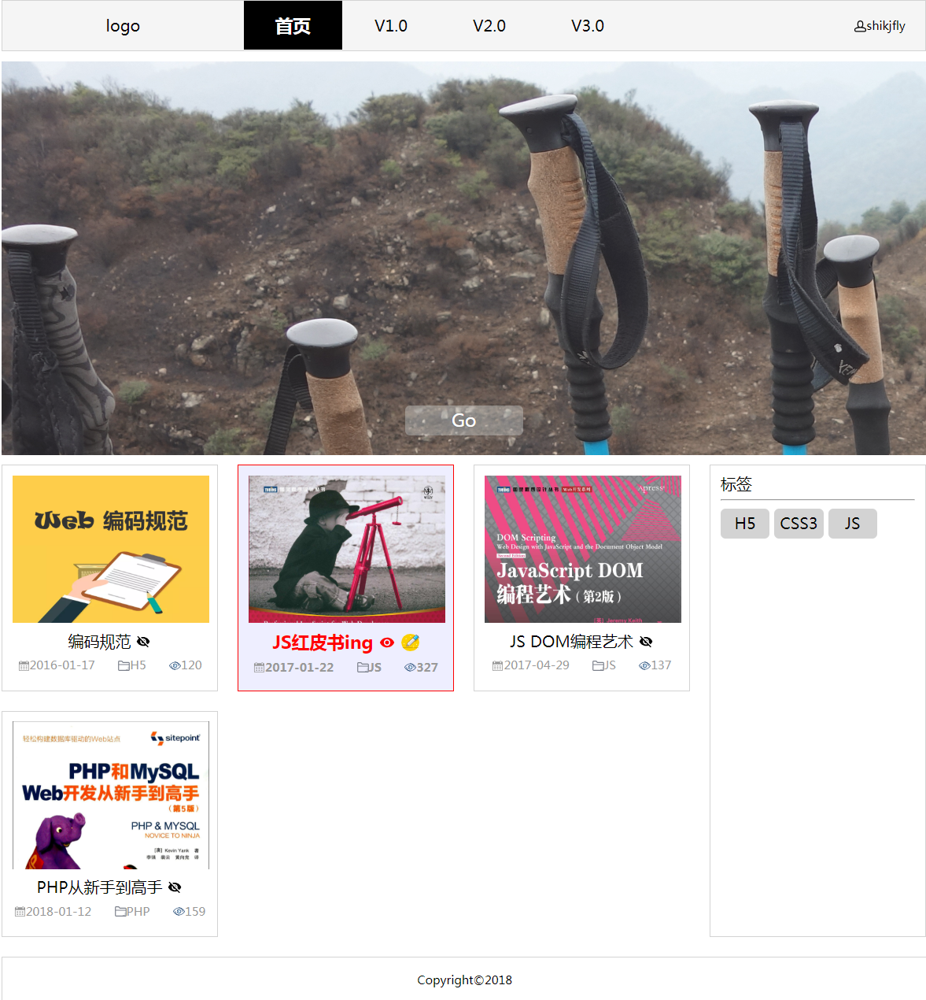
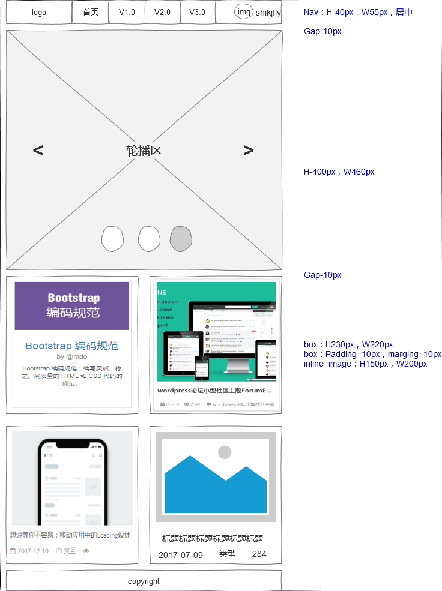
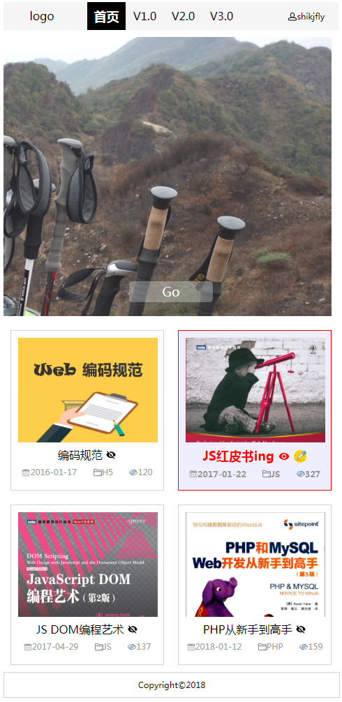
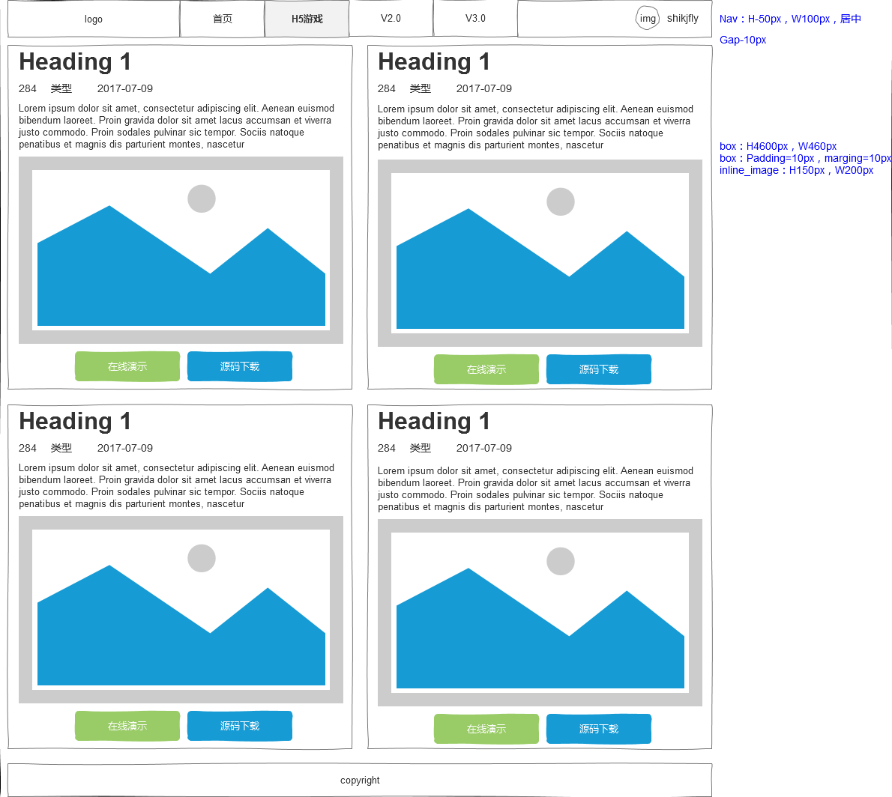

### 页面说明
0. 引言篇
> 小白一枚，目的是熟悉markdown编写语法，及提高逻辑能力，锻炼HTML5、CSS3和JavaScript而来，同时熟知GitHub和Git，**从而为一个静态网页（ http://shikjfly.github.io/ ）的诞生而努力**  

1. 需求篇
> 个人页面需求说明针对自己的想法：
> *读书笔记（选一本书籍，记录学习心得）、计划、收藏夹、兴趣爱好，出去玩的照片可以做轮播图片，需要考虑可拓展性，刚开始用纯H5写，后续拓宽重构*

2. 分析需求构建原型
> 页面布局参考1： http://www.toptheme.org/category/c  
> 
> 页面布局参考2： http://www.qinsman.com  
> 
> PSD素材天下： http://www.sucaitianxia.net/psd/wangye/Index.html  
> 
> PSD三联： http://www.3lian.com/psd/web/  
> 
> 百度首页登录样式： https://www.baidu.com
>
> 1、根据参考的布局，进行页面规划，另字段还未想好，需要和业主（个人）重新沟通是否合理，及其他重要字段，例如菜单需要哪些、类型要选哪些，进行规划，同时UI可以跟进。
> 
> 2、*备注，利用axure创建一个团队项目，进行原型设计，团队地址：*  https://1oli1x.axshare.com
###### 原型_20170426_V1.0.png

> 参考Bootstrap中文网： http://www.bootcss.com  对页面进行重新排版，接下来是细节的完善
###### 原型_20170427_V1.1.png

> 导航进行变更修改，参考XX隐患排除系统的样式、鼠标悬浮参考今日头条，
> 另前几天弄的页面，整体样式感觉还可以，接下来考虑要用H5写出来，初步考虑用Axure自带的960栅格系统，对页面排版微调了，及标注了部分大小，暂未考虑自适应
###### 原型_20170428_V1.2.png

> 根据之前的原型，利用H5和CSS3进行编写出来的效果图
###### WEB_20170430_V1.2.png

> 利用Axure的自适应，制作480手机端原型
###### 原型_20170430_V2.0.png

> 利用CSS3的媒体查询效果，在原来的基础上，调整炜手机端界面
###### WEB_20170430_V1.2.png

#### 暂且告一段落，目前还未用到JS，转战到JS红皮书，也未用到数据库，后续再对该网页进行修正

#### 在JS学习过程中，为了增加趣味性，从而开放该页面，进行简单有效的设计。
> 参考html5tricks布局： https://www.html5tricks.com/  进行原型简单布局，细节图片尺寸，在CSS样式进行调整
###### 原型_20170612_game.png
